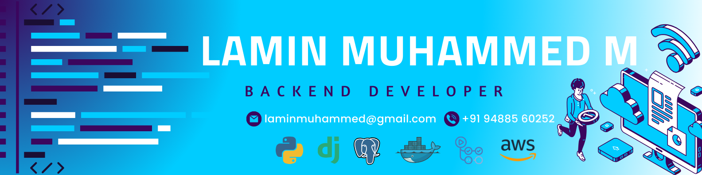
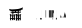

<!--
**Info-lamin/Info-lamin** is a ✨ _special_ ✨ repository because its `README.md` (this file) appears on your GitHub profile.
-->

# Hi there 👋

## I'm Lamin Muhammed | Backend Developer & DevOps Enthusiast

Skillfully weaving digital threads to shape the fabric of tomorrow's technology.

## 🔭 I’m currently working on ...

- **Project AJA:** Building an interactive education platform with Django, Docker, and React.
- **CashWha:** Developing an advanced WhatsApp solution for commercial use with Django and Flutter.
- **Info Panel:** Creating a web-based platform for instant website deployment using Django.

## 🌱 I’m currently learning ...

- **Continuously mastering:** Python, Django, Flask, Docker, GitHub Actions, and Linux.
- **Exploring:** DevOps practices for streamlining development workflows.

## 👯 I’m looking to collaborate on ...

- **Open-source projects:** Particularly interested in Python, Django, and DevOps-related initiatives.
- **Tech Workshops and Events:** Passionate about organizing and contributing to knowledge-sharing sessions.

## 🤔 I’m looking for help with ...

- **Innovative ideas:** Always open to collaboration and brainstorming on exciting projects.
- **Advanced DevOps practices:** Seeking insights into optimizing deployment processes.

## 💬 Ask me about ...

- **Backend Development:** Python, Django, Flask, and DevOps practices.
- **Freelancing:** Successfully managing diverse projects and client relationships.
- **Leadership & Responsibilities:** Leading a team, organizing workshops, and fostering a culture of technical excellence.

## 📫 How to reach me: ...

- **Email:** laminmuhammed@gmail.com
- **LinkedIn:** [linkedin.com/in/info-lamin](https://www.linkedin.com/in/info-lamin/)
- **Portfolio:** [info-lamin.vercel.app](https://info-lamin.vercel.app/)

## ⚡ Fun fact: ...

- **Code Beast Contest Winner (1st Place):** Awarded at KSR College of Engineering and Technology, April 2022.
- **Tech Champ:** Currently serving as Vice-President at Club PyLamp, VCET, spearheading technical leadership and fostering a culture of excellence.

## 🌐 Socials:

  

# 💻 Tech Stack:

### Web Front-End:

-   
-  
-  

### App Front-End:

-  

### Back-End:

- 
-   
-   

### Database:

-   
-  
- 

### Cloud Computing:

-  
-    
-  

### Design:

-  
-   

# 📊 GitHub Stats:

##  
 

### ✍️ Random Dev Quote

## 💰 You can help me by Donating

 

**Copyright © 2024 by Lamin Muhammed | All Rights Reserved.**
